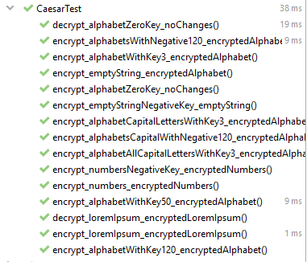
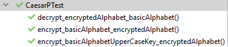
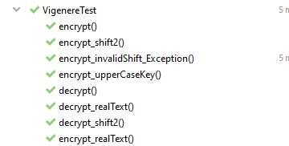
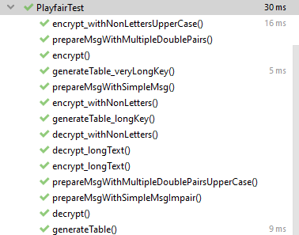

# Laboratory work Nr.  1. 
## Topic: Intro to Cryptography. Classical ciphers. Caesar cipher.

### Course: Cryptography & Security
### Author: Babcinetchi Egor

----

## Objectives:

* Study symmetric ciphers
* Implement classical ciphers:
  * [Caesar cipher with one key](#caesar-cipher)
  * [Caesar cipher with one key and permutation](#caesar-cipher-with-permutation)
  * [Vigenere cipher](#vigenere-cipher)
  * [Playfair cipher](#playfair-cipher)
* Make conclusions on usage of classical, symmetric ciphers


## Implementation description

Each cipher implementation is a separate class that extends the *AbstractCipher* class. <br>
*AbstractCipher* class contains abstract methods *encrypt()* and *decrypt()*.<br>
Also, *AbstractCipher* contains a common *alphabet* representing the latin alphabet:
```
    public String alphabet = "abcdefghijklmnopqrstuvwxyz";
```
This alphabet is used as a base for each implementation of cipher. <br>
*AbstractCipher* contains some common methods like *prepareKey* used to normalize shift keys.<br>
### Caesar cipher

Caesar cipher implementation consist of two main methods defined in *AbstractCipher*: 
* `public String encrypt(String msg) {...}` -  takes as input a message and returns it in an encrypted form.
* `public String decrypt(String msg) {...}` -  takes as input an encrypted message and decrypts it.

Both methods call a method `private String encrypt(String msg, int key)` that encrypts/decrypts input message based on its parameters 
<br> The method takes as arguments `String msg` and `int key`.
* `msg` is the input message to be encrypted/decrypted
* `key` is the key used to shift the message letters. This parameter determines which mode will the method be performed in.
The mode basically depends on the sign of the key. For decryption there is used the same key but with opposite sign.

Encryption method:
```
    @Override
    public String encrypt(String msg) {
        return encrypt(msg, this.substitutionKey);
    }
```
Decryption method:
```    
    @Override
    public String decrypt(String msg) {
        return encrypt(msg, prepareKey(-this.substitutionKey));
    }
```
The logic for encryption/decryption is performed by the method `private String encrypt(String msg, int key)`.
It performs a mapping of each character of a string to its shifted value. <br>
The current implementation supports shifting for letters of latin alphabet, as well as for digits.

#### Testing
To verify implementation there were written several unit tests.
<br>

Mostly, there is tested ` encrypt(String msg) `. `decrypt(String msg)` performs the same operation but with opposite key



### Caesar cipher with permutation
By looking at the naming of this cipher, there might be concluded that it is based on Caesar cipher. Indeed, this cipher
is a slightly improved Caesar cipher discussed before.
<br>
Caesar cipher with permutation uses the same concept of shifting each letter in the message, but in addition to this, 
there is performed a permutation based on a *permutation key*.
<br>
The structure of this is the same as for Caesar cipher. The main difference is the `encrypt()` method:
```
private String encrypt(String msg, String key, String alphabet) {...}
```
* `msg` - as for base Caesar, this parameter represents the input message
* `key` - this is the key used to perform permutation. The key is nothing else than a permuted alphabet.
* `alphabet` - the base alphabet used to determine each letter of the input message

The implementation of `private encrypt()` contains just a simple mapping of each char from `alphabet` to `key`.
<br>
The basic public methods `public encrypt(String msg)` and `public decrypt(String msg)` perform two operations:
1. `new Caesar(int subtitutionKey).encrypt(msg)`. The message is shifted according to base alphabet.
2. `encrypt(String msg, String key, String alphabet)`. The result is mapped based on input key.

The main difference is the order of performing these operations. Encryption first performs shifting then mapping, decryption 
does the opposite.
<br>
Second difference is the key and alphabet used by `private encrypt()`. For decryption the key and base alphabet are changed with 
placed to obtain the opposite mapping.

#### Testing
Due to the fact that Caesar with permutation performs some simple operations of calling `new Caesar()` and direct mapping
 there are not much to test and verify, so there are checked the main methods to perform without any issues


### Vigenere cipher
Vigenere cipher is another classical symmetric cipher. It is based on Caesar cipher using a polyalphabetic 
subtitution for encryption.
<br>
Vigenere cipher uses several Caesar subtitutions to form a table with alphabet letters as indexes and cells.
<br>
The basic principle behind this Vigenere cipher is to make a pair of message letter and key letter. This pair is used to 
find the ciphered letter.
<br>
The implementation is built by extending the main *AbstractCipher* class. Encryption and decryption methods use 
the algebraic description of the Vigenere cipher. The logic of encryption uses indexes of message and key letters to find
the encryption or decryption.
<br>
The main operation performed of each message letter is to find the ciphered value.
This is done by adding indexes of message and key letters in the alphabet. The result is put under modulo not to exit 
the bounds.
<br>
Of course there are other details like managing the key length, shift of *tabula recta* and offset.
* Key length is adjusted not exceed bound limits. Here is also present modulo operation
* Shift of the *tabula recta* add additional layer of security for the algorithm
* Offset is a value that determines whether the method is in encryption or decryption mode

Encryption:
```
    public String encrypt(String msg) {
        return encrypt(msg, true);
    }
```
Decryption
```
    public String decrypt(String msg) {
        return encrypt(msg, false);
    }
```
#### Tests
Here are unit tests for Vigenere Cipher



### Playfair cipher

Playfair cipher is a symmetric cipher using diagram substitution techniques. The cipher is based on encryption of pairs
of letters.
<br>
Playfair cipher is much more complex that ciphers discussed and implemented before in this lab work. It uses 
many techniques for changing the letters and pair
<br>
The implementation of Playfair Cipher can be divided in several parts:
1. Initial setup that includes some preparations operations such as:
   1. Key preparation. There are removed all symbols not related to the alphabet
   2. Table generation. The building of table used to performed mapping of pairs
2. Encryption. This also can be divided in some smaller parts:
   1. Prepare the input message for encryption. It resumes to filtering any non-alphabetic symbols, creating pairs by
   applying rules described in the algorithm (like removing *j*, adding *x* between same letters)
   2. Applying encryption rules (3 in total) to map pairs of letters according to the table

The implementation of basic `encrypt(String msg)` and `decrypt(String msg)` contains the call of the method
`private encrypt(String msg, boolean encrypt){...}` 
<br>
Method `private encrypt(String msg, boolean encrypt)` performs operations as described in the second point of implementation
description.
<br>
The encryption is performed for each pair by applying rules according to the algorithm:
<br>
The rule for two letters on the same row
```
    private char getRightChar(char root) {}
```

The rule for two letters on the same column
```
    private char getCharBelow(char root) {}
```

The rule for two letters corners or a rectangle
```
    private char[] getCornerChars(int[] first, int[] second) {}
```

The decryption is performed by calling the methods for opposite direction mapping.

#### Tests
Unit tests for Playfair cipher. It consists of several groups of tests: preparing input message, table generation, 
encryption and decryption



## Conclusions / Screenshots / Results
In this laboratory work there were studied and implemented some of the most known classical ciphers
<br>
Caesar cipher is based on letter shifting and substitution. Because of its simplicity, it is popular example of ciphers 
used to show the base concepts of cryptography. However, its simplicity makes this ciphers insecure and easy breakable.
As was shown in the implementation, the encryption and decryption use simple techniques that do not require much time to 
break. Because of only 26 possible shifting keys, any human may break the key quickly. For modern computers its a matter 
of milliseconds.
<br>
In order to increase the number of keys, and consequently, the number iterations used to break it, is used permutation.
The logic behind this permutation is simple, just take the alphabet and shuffle it, but the number of possible keys 
increase greatly, up to 4e+26!
<br>
Even if the possible number of keys is so large, it does not mean that enhanced Caesar cipher is fully secure.
Any modern computer can break it a matter of seconds by frequency analysis. To conclude, Caesar cipher with permutation
is an easy-to-implement algorithm, as proved in the lab work, and much more secure than ony using substitution. However,
it is still insecure and impracticable in modern world.
<br>
Vigenere cipher uses the same principle as the Caesar cipher does. The table generated by alternating Caesar ciphers with
several shifts increases the level of security. In addition to table there is present a secret key, an important part for 
security of ciphered text. 
<br>
Even if Vigenere cipher uses secret keys and multiple substitution it still can be broken by use of frequency analysis,
so cannot be used to secure information from modern computers
<br>
Playfair cipher is the most complex from all of described above. It uses digraphs (pairs of letters) to perform encryption 
and a complex system of rules, that makes harder the life of cipher breakers. 
<br>
The disadvantages of Playfair cipher are the same as for other symmetric algorithms. It is relatively easy to break using
frequency analysis. Another disadvantages of this algorithm is the fact of using only one secret key, so it much harder to
secure it
<br>
In conclusion, symmetric algorithms are easy to implement and easy to break using simple techniques that does not require 
usage of modern technologies (it will require a lot of time for some of discussed algorithms). However, this algorithms are
a good start for diving into cryptography and cryptanalysis. 