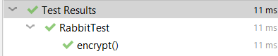
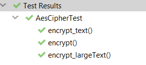

# Symmetric Ciphers. Stream Ciphers. Block Ciphers.

### Course: Cryptography & Security
### Author: Babcinetchi Egor

----
## Objectives:
1. Get familiar with the symmetric cryptography, stream and block ciphers.

2. Implement an example of a stream cipher ([Rabbit cipher](#rabbit-cipher)).

3. Implement an example of a block cipher ([AES cipher](#aes-cipher)).

4. The implementation should, ideally follow the abstraction/contract/interface used in the previous laboratory work.

5. Please use packages/directories to logically split the files that you will have.

6. As in the previous task, please use a client class or test classes to showcase the execution of your programs.


## Implementation description
Both classes extend a common parent abstract class *AbstractCipher*.
<br>
*AbstractCipher* contains two methods: 
<br>
- ```String encrypt(String msg);``` - encrypts the message;
<br>
- ```String decrypt(String msg);``` - decrypts the message;
<br>


### Rabbit cipher
Rabbit cipher implementation consists of 6 main steps:
1. Key setup 
2. IV Setup
3. Next-State Function
4. Counter System
5. Extraction
6. Encryption/Decryption

#### Key setup
Rabbit cipher requires a 128-bit key for initialization.
<br>

The input key is an array of chars, so the first step is to normalize the key to an array of two bytes (16 bits).
A 128-bit key is split into 8 16-bit keys;
<br>
```
    for (int i=0; i<7; i++) {
        subkeys[i] = key[2*i+1] | ((long) key[2 * i] << 16);
    }
```
<br>

Normalization is a key process, as all operations within Rabbit Cipher are performed on bytes obtained from subkeys
<br>

Next step is initializing state and counter variables. State and counter variables are used by g-function to build 
pseudo-random block for encryption purposes.
<br>

```
    X[i] = subkeys[(i+1)%8] | ( subkeys[i] << 16);
    C[i] = subkeys[(i+4)%8] | ( subkeys[(i + 5) % 8] << 16);
```
<br>

System iteration provides increased security by iterating 4 times next-state function:
<br>

```
    for (int i =0; i<4;i++) {
        nextState();
    }
```
<br>

System iteration couples state variables and counter variables. In this way, each state variable is modified by other 
variables, increasing the level of cipher confusion.
<br>

```
for(int i=0;i<8;i++){
    if((i&1)==1)
        X[i] = g[i] + rotateLeft(g[(i+7)%8],8) + g[(i+6)%8];
    else
        X[i] = g[i] + rotateLeft(g[(i+7)%8],16) + rotateLeft(g[(i+6)%8],16);
}
```
<br>

During next-state generation function there is performed update of counter variables. Modification of counter variables 
ensures removing all connections with past state variables. It hardens the breaking of ciphered text by introducing each
round new counter values.
#### IV setup
IV's purpose is  to add randomness to the encryption process. IV is an 8 byte value used for initial rounds of encryption.
In this way, each round depends on this IV, making breaking the ciphered text much harder. IV affects each state variable
and g-functions via system iteration.
<br>
```
    long[] exIv = new long[] {
            iv[3] | iv[2] | iv[1] | (iv[0] << 32),
            iv[7] | iv[6] | iv[5] | (iv[4] << 32)
    };

    C[0]=C[4]^=exIv[0];
    C[2]=C[6]^=exIv[1];

    C[1]=C[5]^=(((exIv[1]>>16)<<16) | (exIv[0]>>16) );
    C[3]=C[7]^=((exIv[1]<<16) | ((exIv[0]<<16)>>16) );
```
#### Extraction
At this step there are obtained keystream blocks by xoring the state variables from previos steps
<br>

Ex: for the first block 
<br>
```
    long x = X[0] ^ X[5] >>> 16;
    S[0] = (byte) x;
    S[1] = (byte)(x >> 8);
```
#### Encryption/Decryption
The last step is the encryption of the text.
<br>

Each byte of the input text is xored with obtained keystream block from previous step
<br>
```
b[i] ^= S[i%16];
```

#### Tests


### AES cipher
AES cipher consists of three main entities:
1. Input Block
2. State Block
3. Output Block

#### Input blocks
Each of this entities is obtained by transformations, computations and other arithmetic operations specific to AES.
<br>

First entity - input block is obtained by dividing text into 128-bit blocks. This is done during encryption/decryption
process.
<br>

```
    int blockLen = 16;
    for (int i = 0; i < msgBytes.length; i +=blockLen  ) {
        char[] ciphered = cryptBlock(Arrays.copyOfRange(msgBytes, i, i+blockLen), w, encrypt);
        for (char b : ciphered) {
            cipheredMsg.add(b);
        }
    }
```
<br>
In the code above, the input text is divided in blocks of 16 bytes (128 bits) and crypted according to AES rules
<br>

It is important to notice that before dividing it is necessary to normalize input text to be able to separate it into blocks
of 16 bytes.
<br>

```
    char[] msgBytes = new char[((int) Math.ceil(msg.length()/(double)16))*16];
    Arrays.fill(msgBytes, (char) 0);
    char[] msgChars = msg.toCharArray();
    System.arraycopy(msgChars, 0, msgBytes, 0, msgChars.length);
```
#### State blocks
State blocks are obtained through key expansion.
<br>

Key expansion requires an input key. The input key is used to obtain initial states.
Initial states are words of 4 8-bit subkeys. The resulting state is a word of 32-bit length.
<br>
```
while (i < NK) {
    w[i] = convertToInt(new long[]{key[4 * i], key[4 * i + 1], key[4 * i + 2], key[4 * i + 3]});
    i++;
}
```
<br>
Based on the initial states, there are computed next states using S-box operations, rotations and xoring.
<br>

The first operation performed to obtain the next state is word rotation *rotWord()*. This function performs a cycling permutation of 
word bytes.
<br>

Next function is *subWord()*. At this step, the word is modified by S-boxes for each byte.
<br>

```
cBytes[i] = AesCipherUtils.SBOX[(int) (tBytes[i] / 16L)][(int) (tBytes[i] % 16L)];
```
<br>

Finally, the obtained value is xored with a constant value *rcon[]* - round constant.
<br>

*rcon* constant might be considered the key security feature of the cipher. It uses Galois fields to obtain constant array
values that increase cipher diffusion. The same concept is used for encryption process for mixing columns
<br>

```
c = (c << 1) ^ (0x11b & -(c >> 7));
```
Above is represented the formula for constant computing;
#### Output Blocks
Output blocks are generated during encryption/decryption process. There are 4 main transformations applied on input blocks
to obtain the output blocks:
1. *subBytes()*
2. *shiftBytes()*
3. *mixColumns()*
4. *addRoundKey()*
<br>

These 4 transformations are applied for 10 rounds. 
<br>

Each round has its own key, called *roundKey*. Round keys are generated at the initial round, and after all trasformations for 
next 10 rounds.
<br>

For roundKey generation there are used keyState blocks. For each msgState blocks there is performed a xor operation with
keyStates.
<br>
```
state[i][j] = (char) (state[i][j] ^ keyState[i][j]);
```
<br>
Next 9 round there are performed other 3 transformations + round key generation.
<br>

The first transformation for each round is *subBytes* operation. This transformation is nothing else then a substitution
with S-box values
<br>

Next transformation is row-shifting. It is a simple shift of bytes of each row according to a pattern where each row is
shifted left to i positions, where i is the position of the row in the matrix;
```
        for (int i = 0; i < row.length; i++) {
            temp[i] = row[(i + shift) % row.length];
        }
```
<br>

The third transformation is column mixing. Column mixing is a matrix multiplication, where columns are considered as 
polynomials and multiplied by a fixed polynomial. 
<br>

In order to find compute this polynomial there can be used two approaches:

1. Using precalculated values
2. Computing multiplication *axb* and additions *a+b* for each polynomial.
<br>

Here is implemented the second approach
<br>

In order to compute polynomial, it is required to perform two operations: addition and multiplication
<br>
Addition is a simple operation that requires a xor operation.
<br>
Multiplication is much more complex operation.
<br>
Fortunately, smart guys already figured out how to find the product for this operation. Multiplication requires shifting and modular reduction
<br>
```
((b << 1) ^ (0x11b & -(b >> 7)));
```

The last step after all transformations described above is computing the next round key.
<br>

For the last 10th round, the transformation are the same excepting the *mixColumns()* transformation
<br>

The decryption involves the same steps and transformations with some minor changes like:
1. The next round key is generated before mixing columns. 
2. The decryption of the input blocks is in reversed order.
3. *subBytes()* uses Inverse S-Box values
4. *shiftBytes()* uses a reversed shift value
5. *mixColumns()* uses another pattern for polynomial computations (with the same operations of doubling and addition, just other constants)
<br>
#### Tests


## Conclusions / Screenshots / Results
On Laboratory Work Nr.2 there were studied and implemented 2 symmetric ciphers: Rabbit Cipher (stream cipher) and AES cipher (block cipher).
<br>

Rabbit cipher is a stream cipher based on a 128-bit key and 64-bit IV. The strength of this cipher is in combining the 
inner states to obtain the next state. This mixing occurs during the whole process of state generation. In this way, the 
cipher has a high level of confusion, making it practically impossible to break (according to the creators of this cipher)
<br>
Rabbit cipher is based on basic operations that do not require moder hardware. The encryption is very fast and fully optimized
for usage on less productive hardware.
<br>
The implementation of rabbit cipher is also simple in terms of operations involved. The whole process of key generation 
and encryption involves basic arithmetic and bitwise operations. The implementation can be optimized more by using low level
tools such as Assembler.
<br>
AES cipher, a block cipher, has become the standard cipher for most of the devices and software that requries encryption.
It is easier to understand than Rabbit cipher as the steps of key generation and encryption includes basic concepts and 
transformations. The only exception is a complex concept of Galois fields and matrix multiplication that are used for 
encryption. But even this transformation can be represented by basic bitwise and arithmetics operations.
<br>
By using a lot of transformation that requires more computational time to be completed than for Rabbit cipher, it needs 
much more complex hardware and computational power.
<br>
A big difference between studied ciphers is the process of decryption. While AES requires a separate algorithm for 
decryption, Rabbit cipher uses the same algorithms for both encryption and decryption.