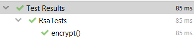

# Topic: Asymmetric Ciphers.
### Course: Cryptography & Security
### Author: Babcinetchi Egor

----
## Objectives:
1. Get familiar with the asymmetric cryptography mechanisms.
2. Implement an example of an asymmetric cipher ([RSA Cipher](#rsa-cipher)).
3. As in the previous task, please use a client class or test classes to showcase the execution of your programs.

## Implementation
*RsaCipher* class is an extension of *AbstractCipher* class. It implements abstract
methods ```encrypt()``` and ```decrypt()```
<br>

### Key generation
First step in encryption/decryption process is key generation. Key generation consists of 
obtaining necessary public and private keys for encryption and decryption.
<br>
First there is initialized the class by accessing its constructor and passing prime numbers *p* 
and *q*. In order to avoid overflows, the type of these primes is ```BigInteger```.
To have a working crypting there are required keys: *e* and *d*, and modulus *n*. *n* is generated by multiplying *p* and *q*.
<br>
Next step is computing totient. Totient is the lowest common multiple of *n*. Another way of representing the totient is
*lcm((p-1),(q-1))*. As *p* and *q* are primes, the lcm is *(p-1)***(q-1)*
<br>
```(bigP.subtract(BigInteger.ONE)).multiply(bigQ.subtract(BigInteger.ONE))```
<br>
Public key, *e*, is an integer between 1 and totient. *e* should be a comprime with totient. The most optimal choice for 
*e* is the Fermat number of term 4 that is 65537.
<br>
By knowing *e* and *n* there can be computed private key *d*. Private key is the modular inverse of *e* mod *n*.
<br>
```       
 d = e.modInverse(totient);
```
<br>

### Encryption
Encryption process consists of iterating input string char by char. There is found the modular power of the next char and 
appended to a final string.
<br>
```
BigInteger c = msg.modPow(e, n);
```
<br>

### Decryption
Decryption is performed for each encrypted char. Each char is iterated and passed through decryption function.
Decryption function is a modular exponentiation with exponent d and modulus n
<br>
``` 
BigInteger msg = new BigInteger(eChar).modPow(d, n);
```
<br>

## Tests


## Conclusion
For Laboratory Work Nr.3 there was studied and implemented RSA Cipher. Rsa cipher
is an asymmetric cipher based on prime factoring.
<br>
There were implemented key generation, encryption and decryption functions.
For key generation there were computed modulus and private key, and set a public key. 
The obtained keys and modulus were used first for encryption and then for decryption.
For each implemented method there were written tests.
