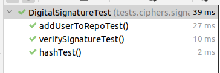

# Topic: Hash functions and Digital Signatures.
### Course: Cryptography & Security
### Author: Babcinetchi Egor

----
## Objectives:
1. Get familiar with the hashing techniques/algorithms.
2. Use an appropriate hashing algorithms to store passwords in a local DB.
   1. You can use already implemented algortihms from libraries provided for your language.
   2. The DB choise is up to you, but it can be something simple, like an in memory one.
3. Use an asymmetric cipher to implement a digital signature process for a user message.
   1. Take the user input message.
   2. Preprocess the message, if needed.
   3. Get a digest of it via hashing.
   4. Encrypt it with the chosen cipher.
   5. Perform a digital signature check by comparing the hash of the message with the decrypted one.
   
## Implementation
The implementation can be divided in two parts (except testing):
1. Database management.
2. Digital signature creation and verification
### Database management
Database *PasswordRepository* is a data structure that acts as an in-memory datastore. The object itself is 
a singleton containing a dictionary with key and value as strings. 
<br>
*PasswordRepository* is meant to store password as values and users as keys.
<br>
The object itself provides two main methods:
1. ```add(String user, String password)``` - adds new entry in database. It can be considered as an update method to
as the operation is performed on a HashMap.
2. ```get(String user)``` - retrieves the password stored in db based on the user passed as parameter
<br>

The database is mainly used for adding new hashed passwords and using them for verifying of digital signature.

### Digital Signature Management
Digital Signature management is performed by class *DigitalSignature*.
<br>
In order to validate a digital signature, we should have a digital signature <sub>Well... surprise, surprise :-)</sub>.
The method ```String create(String message)``` is responsible for creation steps of a signature.
First of all there is performed hashing. For this there is used builtin tool provided by java.security package. Hashing 
is done in ```String hash(String message)```. It takes an string message and performs SHA256 hashing.
<br>
Next step is encrypting obtained message using a public key encryption. For this implementation there was used RSA algorithm
<br>
In order to perform the encryption and decryption there were changed some implementation details of previous version of  RSA. More 
specifically there were added methods that encrypts using private key and decrypts using public one.
<br>
For validating the digital signature there is performed a comparison between hashed password from database and decrypted 
digital signature. In order received information to be considered valid, both resulting strings should be equal.

## Tests



## Conclusion
During Laboratory work Nr 4 there were studied hashing algorithms and implemented digital signature verification.
<br>
There was used SHA256 algorithm for hashing and RSA algorithm for encryption. 
<br>
In order to simulate a full flow of generating a digital signature and validating data there were implemented database,
a mock Certificate Authority and a data validator. As consequence, there was performed hashing, encryption and decryption 
operation. For each of this operation there was created tests.